# Digital Communication Project
Simulate the performance of different modulation schemes,[BPSK](#a), [QPSK](#b), [FSK](#c), [QAM16](#d),[QAM64](#e) in an AWGN environment 

# Raised Cosine Filter
 [BPSK with Raised Cosine](#f), [QPSK with Raised Cosine](#g), [QAM16 with Raised Cosine](#h), [QAM64 with Raised Cosine](#j)
 # To reproduce the result:
 1. Open matlab
 2. Choose simulink from the toolbar 
 3. Open the desired model 
 4. Write bertool in the command window and set Eb/N0 -10:1:10 in theoritcal and monte carlo 
 5. Press browse and choose the model.slx
 6. Ber variable Name = ber
 7. Press plot in theoritcal and run in monte carlo

# General Parameters:

## Random Integer Generator
    - Samples per frames =  100
    - Initial Seed = 37 
    - Sample Time = 1
 ## AWGN channel
    - Initial Seed = 67
    - Eb/No = EbNo
# Binary Phase Shift Keying (BPSK)
## Definition: 
BPSK is a two phase modulation scheme, where the 0’s and 1’s in a binary message are represented by two different phase states in the carrier signal: θ = 0 degree for binary 1 and θ = 180 degree for binary 0

## Paramters:
    - Random Integer Generator size =  2
    - Phase offset = 0 
## Schematic:

## Before Noise Scatter plot:

## After Noise Scatter plot:
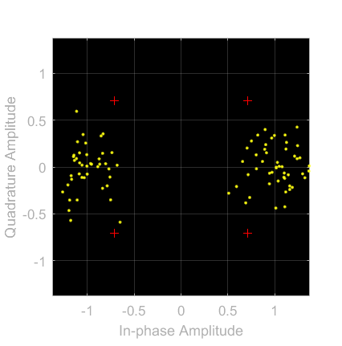
## Ber Graph

#  QPSK
## Definition: 
QPSK is a form of Phase Shift Keying in which two bits are modulated at once, selecting one of four possible carrier phase shifts (0, 90, 180, or 270 degrees)
## Paramters:
    - Random Integer Generator size =  4
    - Phase offset = pi/2
## Schematic:
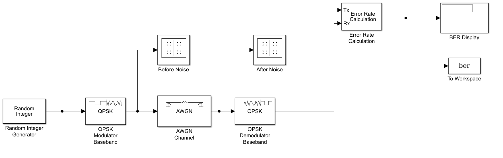
## Before Noise Scatter plot:
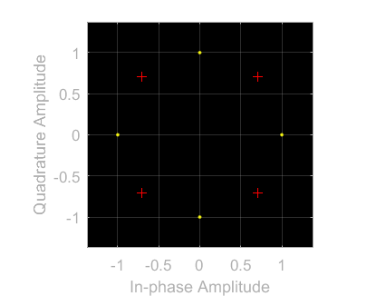
## After Noise Scatter plot:
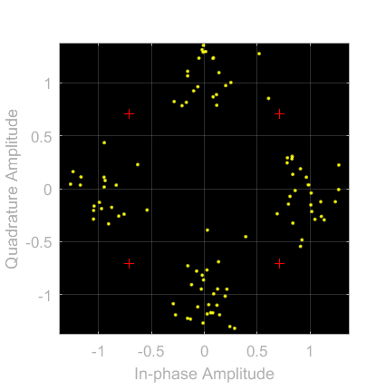
## Ber Graph
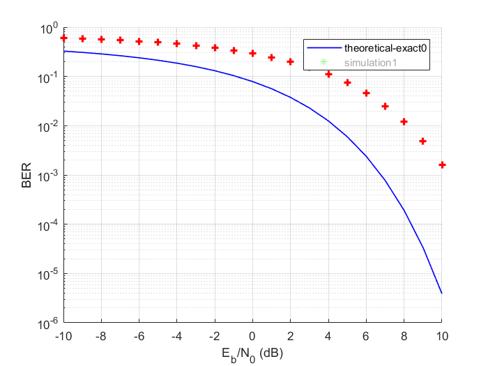

## QAM16
### Definition: 
QAM is a technique used to transmit two digital bit streams or two analog signals by modulating or changing the amplitudes of two carrier waves so that they differ in phase by 90 degrees, a quarter of a cycle, hence the name quadrature. One signal is called the "I" signal and the other is the "Q" signal.
## Paramters:
    - Random Integer Generator size =  16
    - M-ary number = 16
    - Normalization method = Average Power
## Schematic:
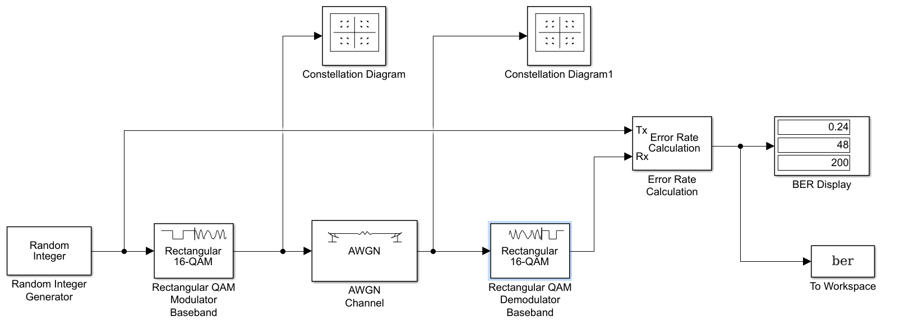
## Before Noise Scatter plot:
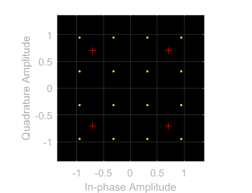
## After Noise Scatter plot:
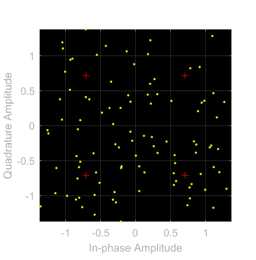
## Ber Graph
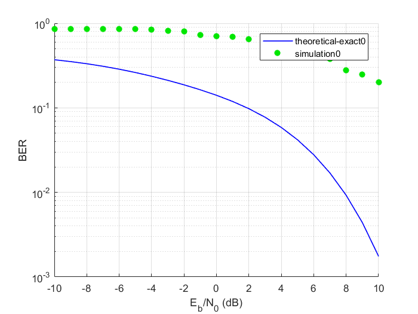

## QAM64
## Paramters:
    - Random Integer Generator size =  64
    - M-ary number = 64
    - Normalization method = Average Power
## Schematic:
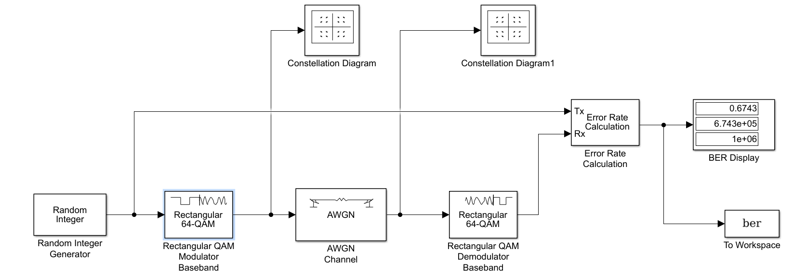
## Before Noise Scatter plot:
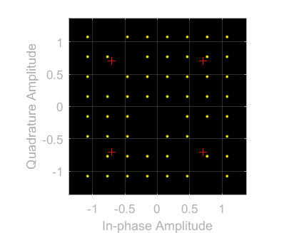
## After Noise Scatter plot:
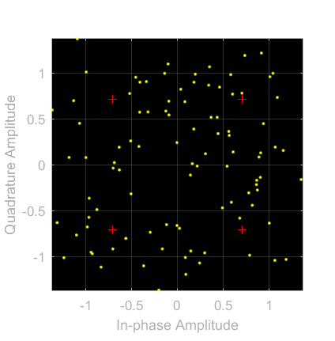
## Ber Graph
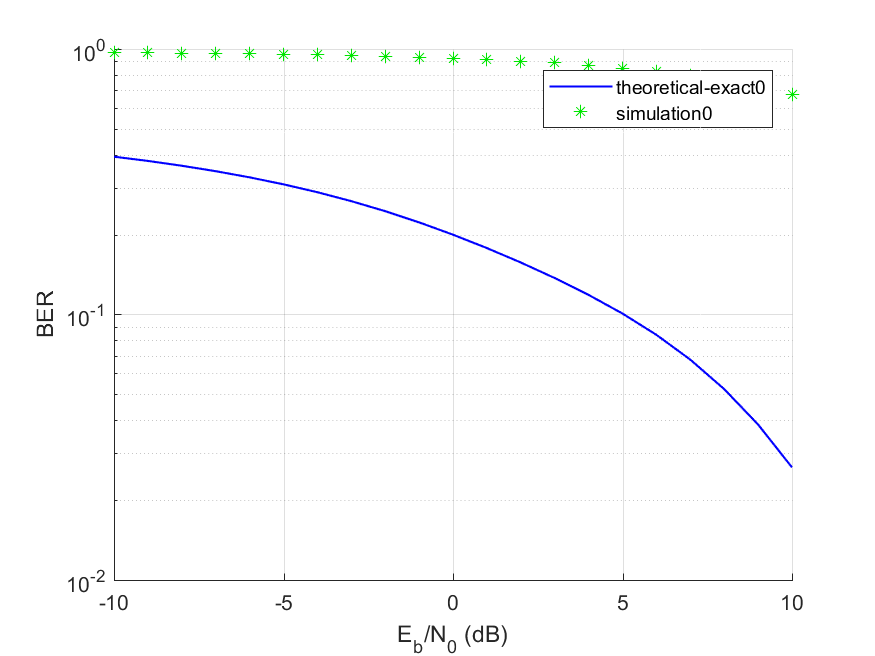

##  FSK
### Definition: 
FSK is a frequency modulation scheme in which digital information is transmitted through discrete frequency changes of a carrier signal.
## Paramters:
    - Random Integer Generator size =  8

## Schematic:
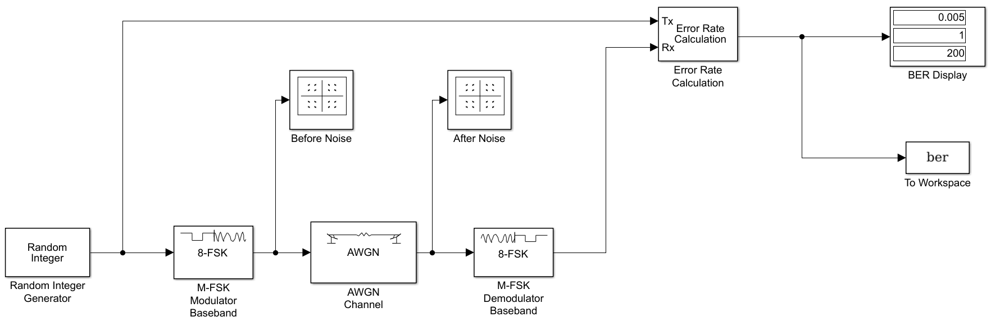
## Before Noise Scatter plot:
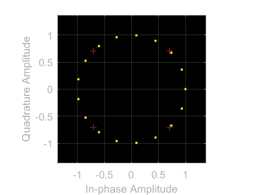
## After Noise Scatter plot:
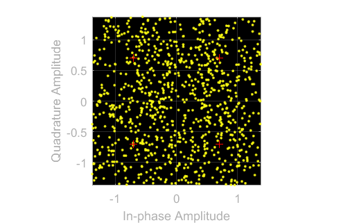
## Ber Graph
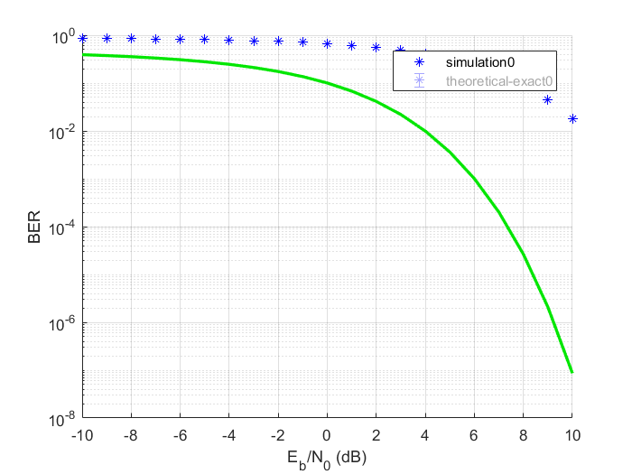

# Raised Cosine Filter

## Parameters:
    - Rolloff factor = 0.2
    - Recieve delay = 2 

##  BPSK
## Schematic:

## Before Noise Scatter plot:
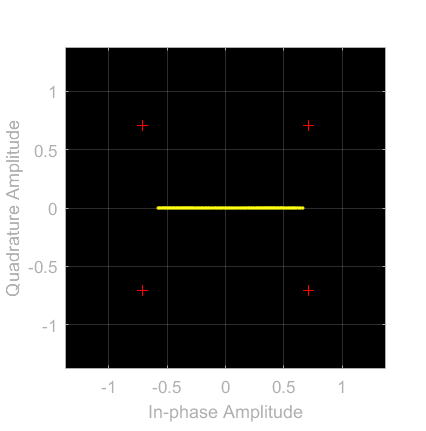
## After Noise Scatter plot:
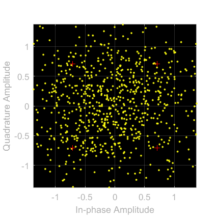
## Ber Graph
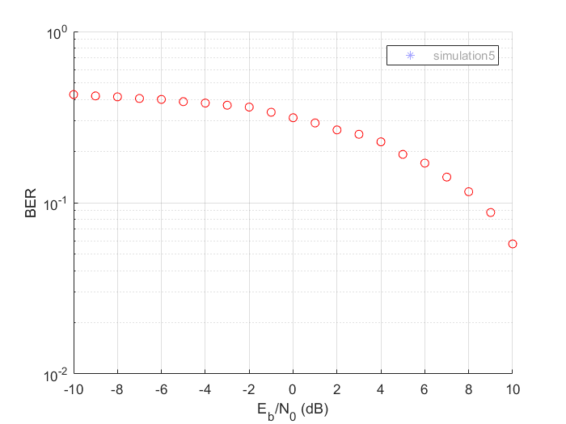

##  QPSK
## Schematic:
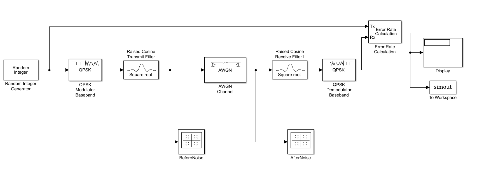
## Before Noise Scatter plot:
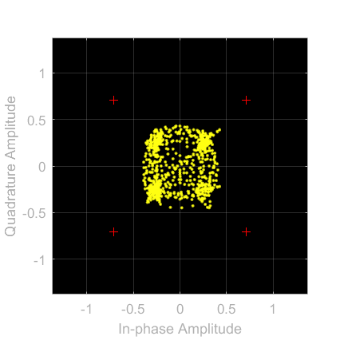
## After Noise Scatter plot:
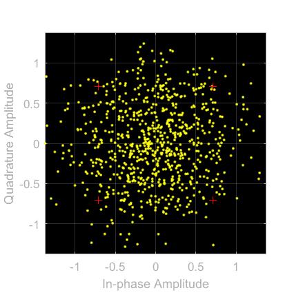
## Ber Graph
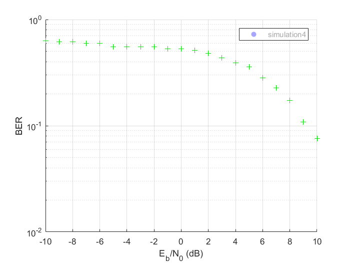

## QAM16
## Schematic:
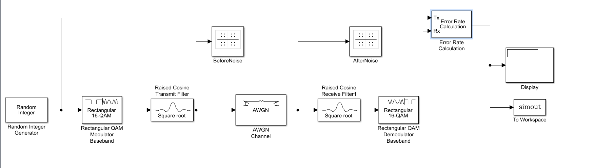
## Before Noise Scatter plot:
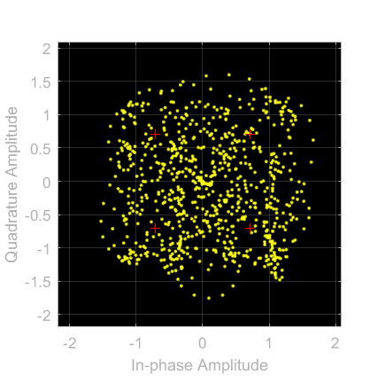
## After Noise Scatter plot:
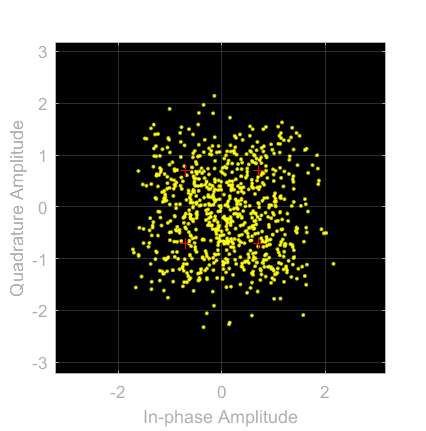
## Ber Graph
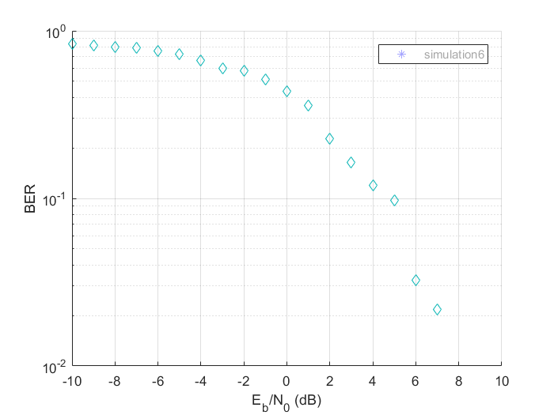

## QAM64
## Schematic:

## Before Noise Scatter plot:
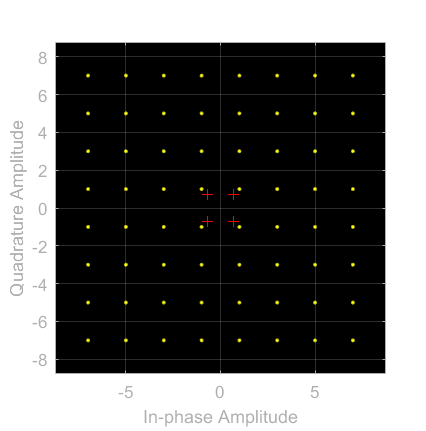
## After Noise Scatter plot:
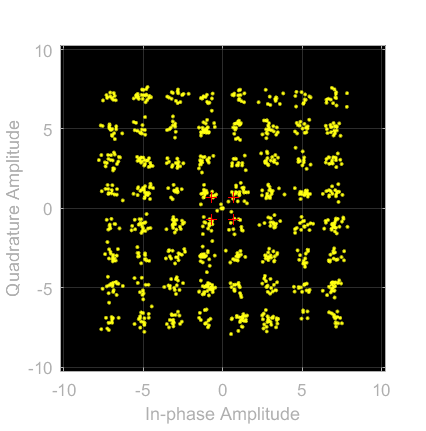
## Ber Graph
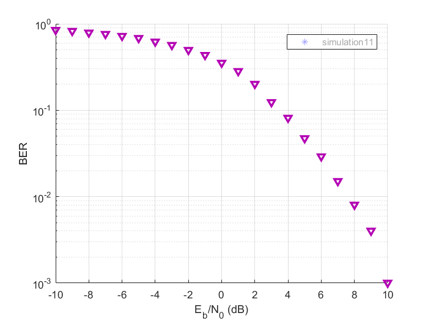